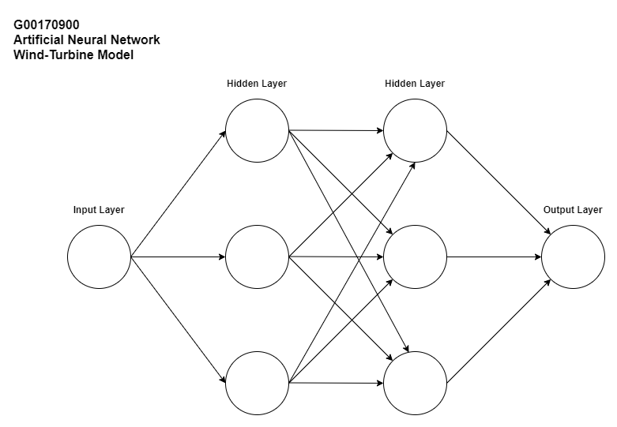

# Emerging-Technology-Project
This is Web service that uses machine learning to make predictions based on a wind turbine data set. The user can enter a given wind speed and the API will use an Artificial Neural Network to return the predicted power output.

## Docker
Containers are a standardised unit of software that allows developers to isolate applications from the deployment environment. This removes historical issues in relation to applications not working on certain machines due to compatibility issues with operating systems, software, hardware, drivers etc. Docker has become ubiquitous in building and deploying containerised applications from desktop applications to cloud based services.

#### How to build a Docker Image
```bash
$ docker build -t appname-app
```

#### How to create a Docker Container from an Image
```bash
$ docker run -d -p 5000:5000 appname-app
```

#### How to Connect to the Containerised Web Application
- Open Web Browser
- 127.0.0.1:5000 (The port number specified by the docker container) 

## Keras 
Keras is an API built upon TensorFlow that is designed for machine learning. If offers a simple and efficient API that allows for users to develop Artificial Neural Networks without being exposed to the complexities of the underlying architecture. It also provides extensive documentation and developer guides to aid in the development of artificial neural networks for software engineers, data scientists and researchers.

#### Artificial Neural Network
The prediction model is a  multi-layered neural network that uses the mean squared error as the basis of evaluation for the training process. The network contains an input layer consisting one neuron, two hidden layers consisting of three neurons each and finally an output layer of one neuron.



## Flask
Flask is a framework written in Python. It is classified as a microframework as it does not require any particular tools or libraries to function. Flask supports extensions that can add application features as if they were implemented in Flask itself.

#### Werkzeug
Werkzeug is a utility library for Python, it functions as a toolkit for Web Server Gateway Interface applications. Werkzeug can realise software objects for request, response and utility functions.

#### Jinja
Jinja is a web template engine for Python. Jinja is similar to the Django template engine but provides Python-like expressions while ensuring that the templates are evaluated in a sandbox. It is a text-based template language and thus can be used to generate mark-up language or source code.

#### Serving a Web Application

```python
# Create a new web app.
app = fl.Flask(__name__)

# Add root URL route.
@app.route("/")
def home():
  return app.send_static_file('index.html')
```

